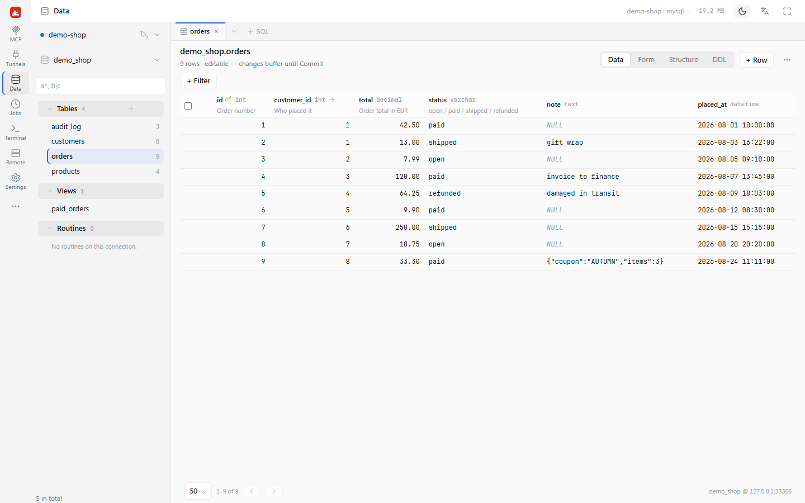

# swiss

<p></p>

A developer's pocket multitool — one tiny local process, every tool behind one loopback port.

swiss serves on `127.0.0.1:19999`: every MCP server an AI client needs, on HTTP paths under
`/mcp/<name>`, plus database browsing, SSH tunnels, scheduled jobs, remote execution and a web
terminal — one static binary with its admin panel embedded, no script runtime, no
`node_modules`, no npx wrapper.

**Why it exists:** memory. The Node.js gateway it replaced measured 113.8 MB RSS on a typical
workload; the same workload here reads **22.4 MB** (private bytes 8.6 MB). The numbers are
records, not gates — [SPEC §product.memory](docs/SPEC.md) holds them.



## Install

Download the archive for your OS and `SHA256SUMS` from
[GitHub Releases](https://github.com/young1lin/swiss/releases):

| Asset | OS |
| --- | --- |
| `swiss-<version>-x86_64-pc-windows-msvc.zip` | Windows x64 |
| `swiss-<version>-x86_64-unknown-linux-gnu.tar.gz` | Linux x64 |
| `swiss-<version>-aarch64-unknown-linux-gnu.tar.gz` | Linux arm64 |
| `swiss-<version>-aarch64-apple-darwin.tar.gz` | macOS (Apple Silicon) — experimental¹ |
| `swiss-<version>-x86_64-apple-darwin.tar.gz` | macOS (Intel) — experimental¹ |

The Linux binaries need glibc 2.35 or newer (Ubuntu 22.04, Debian 12, or later).

Compare the archive's SHA-256 with its line in `SHA256SUMS`
(`Get-FileHash <archive> -Algorithm SHA256` on Windows, `sha256sum <archive>`
on Linux, or `shasum -a 256 <archive>` on macOS). Extract it, then put
`swiss.exe` or `swiss` on your PATH (`swiss path on` does it for your user). Each archive also includes `LICENSE`, `NOTICE`,
`THIRD_PARTY_NOTICES.md`, and standalone `skills/swiss/SKILL.md` and
`skills/swiss-remote/SKILL.md` for inspection before installing or running the binary.

¹ macOS builds have no master-key source yet (no machine-id, no Keychain source), so the
  first state save fails with "no master key available". The assets are published for
  evaluation; a Keychain source is tracked future work. CI lints on the Apple Silicon runner
  for every change and builds both macOS targets for each release, but does not run the test
  suite there yet: besides the key, a killed local shell's pty does not reach EOF on macOS,
  and the gateway's own memory reads 0 MB there.

```
swiss --version        # verify the installed binary
swiss skill install    # install the embedded swiss and swiss-remote AI skills
swiss status           # check whether a gateway is already running
swiss start            # start the gateway on 127.0.0.1:19999 and open the panel
swiss token            # the bearer token an MCP client authenticates with
swiss creds            # panel URL + token, ready to paste into a client
```

The opt-in [`swiss` skill](src/skill_assets/SKILL.md) covers safe installation, checksum
verification, and local checks. [`swiss-remote`](src/skill_assets/remote/SKILL.md) covers
configured remote targets, file transfer, and run history. Both are embedded in the binary
and installed to `~/.agents/skills`, `~/.claude/skills`, and
`~/.cursor/skills`; run `swiss skill install` again after upgrading. Neither skill starts
the gateway or exposes tokens just because an agent loads it.

Or build from source: Rust stable, `cargo build --release` — the same single binary. Linux
additionally needs `cmake` and a C compiler (the TLS stack builds aws-lc-rs). Node is not
needed to build; see [CONTRIBUTING.md](CONTRIBUTING.md).

## Quick start

1. `swiss start` brings the gateway up on `127.0.0.1:19999` and opens the panel.
2. On the MCP page, **Add an MCP**: a stdio command (`npx …`, `uvx …`), a remote HTTP MCP,
   tools declared over a REST API, or a MySQL / PostgreSQL / Redis connection served by an
   in-process driver. **Import .mcp.json** brings an existing client config across in one
   step. A stdio MCP stays idle until its first request and is reaped again after idling, so
   one that is not in use costs nothing.
3. Connect a client from the MCP's `⋯` menu → **Connect a client**. *Copy Claude Code command*
   puts this on the clipboard with the live token filled in:

   ```
   claude mcp add --transport http -s user <name> http://127.0.0.1:19999/mcp/<name> --header "Authorization: Bearer <token>"
   ```

   The same menu copies a Codex `config.toml` block, a `.mcp.json` entry or the bare endpoint
   URL, and `swiss token` prints the token for any other client.
4. Keep credentials out of the config: a field takes `${ENV_VAR}` or `${secret://name}`, and
   **Settings → Secrets** stores a value once, write-only. References expand only at use time.

## Security model

- **Loopback only.** The gateway binds `127.0.0.1`, refuses every request whose `Host`/`Origin`
  is not loopback (DNS rebinding can make a remote page aim same-origin-looking requests at a
  loopback listener), and refuses a non-loopback `host` in config at load. Reach it remotely by
  forwarding the port over SSH, never by widening the bind.
- **A sign-in for the panel and `/api/*`.** `swiss start` and `swiss open` open a single-use
  link that expires in two minutes and trades itself for an `HttpOnly`, `SameSite=Strict`
  cookie that counts only from the panel's own pages (a page on another local port cannot ride
  it, nor frame the panel); the CLI signs its calls with a key rotated on every start
  (`swiss api` is the scripted way in). Another local user or a process that only knows the
  port gets 401.
- **A bearer token for `/mcp/*`**, checked before the body is read, so other tools on the
  machine cannot use your MCP servers unchallenged. The terminal WebSocket adds a single-use
  ticket that burns in 10 seconds.
- **Credentials stay out of records.** Run records mask resolved credential values before
  anything is stored.

If you forward the port over SSH, the far side gains the token boundary — not the loopback one.
The full model is [SPEC §security](docs/SPEC.md).

## Update

`swiss update` compares the running build with the newest GitHub release and prints the steps.
The update itself stays a manual swap, on purpose — a downloader inside a resident process is
the opposite of the memory budget this project exists for.

```
swiss update     # "up to date", or the newest release and its download link
swiss stop
# replace swiss(.exe) with the binary extracted from the new release archive
swiss start
```

Nothing migrates during an update: all state lives in sealed files under the swiss home
directory (`%USERPROFILE%\.swiss` on Windows, `~/.swiss` elsewhere), never inside the
binary. Moving machines uses `swiss export > bundle.json` and `swiss import bundle.json`.
On Windows the seal binds to your user (DPAPI); on Linux it binds to the machine via the
world-readable machine-id, not to your user — treat shared hosts accordingly.

## Start at sign-in, and swiss on your PATH

The panel's Settings → Plugins page has a This machine section with two switches, "Start swiss
when you sign in" and "Put swiss on your PATH". Both act for your user only. From the terminal:

```
swiss autostart on     # Windows: an HKCU Run value · macOS: a LaunchAgent · Linux: a systemd user unit
swiss autostart off
swiss path on          # Windows: this exe's folder in your user Path · elsewhere: ~/.local/bin/swiss
swiss path off
```

A PATH change reaches terminals opened afterwards; ones already open keep their old PATH.

## Documentation

The design record is one living document, [`docs/SPEC.md`](docs/SPEC.md): what swiss does now,
organised by area (product and memory, architecture, formats, the host, each plugin, the panel,
security, testing, release), with the decision log (ADR-001 …) as its last section.

## Non-goals

- **Never remote.** Loopback-only is the boundary; forward over SSH instead of widening it.
- **No self-updating binary.** `swiss update` checks and instructs; the swap is yours.
- **No saving on `proc` MCPs.** An `npx`/`uvx` child is 50–150 MB and stays exactly that.

## Contributing and security

[CONTRIBUTING.md](CONTRIBUTING.md) covers the build, the gates and the house rules (the long
version is [AGENTS.md](AGENTS.md)); [SECURITY.md](SECURITY.md) says how to report a
vulnerability privately — swiss holds credentials, so please use it rather than a public issue.

## License

Apache License 2.0 — see [LICENSE](LICENSE) and [NOTICE](NOTICE). Third-party material and its
terms are listed in [THIRD_PARTY_NOTICES.md](THIRD_PARTY_NOTICES.md): the panel vendors xterm.js
and its addons (MIT), cronstrue (MIT) and shlex (MIT) under `crates/swiss-panel/src/admin_assets/js/vendor/`,
each directory carrying the upstream license text; the zai-vision adapter reproduces prompts
from `@z_ai/mcp-server` (Apache-2.0, Z.AI); the binary statically links the crates the file
tabulates.